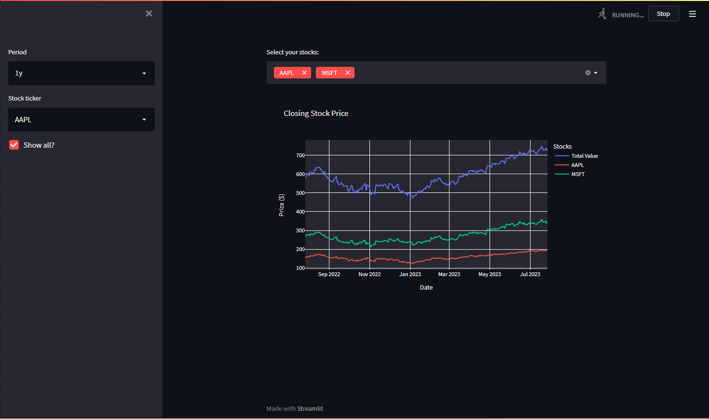

# Stock Portfolio Visualization Web App



This web app allows you to track and visualize a selection of stocks from the S&P 500 index. The app is built using Streamlit and Python and utilizes the yfinance library to fetch stock data and Plotly graph objects to create interactive plots.

## Prerequisites

Before running the app, make sure you have the following installed:

- Python 3
- Streamlit
- yfinance
- pandas
- plotly

You can install the required packages using pip:

```bash
pip install streamlit yfinance pandas plotly
```

## How to Run the App
1. Clone or download this repository to your local machine.
2. Open a terminal or command prompt and navigate to the project directory.
3. Run the app using the following command:

``` bash
streamlit run stock.py
```

## Usage
1. Upon running the app, a list of available stock tickers from the S&P 500 index will be displayed.
2. Select the stocks you want to visualize by using the multiselect widget.
3. Choose the period for which you want to visualize the stock prices using the dropdown menu on the sidebar.
4. The app will fetch the historical closing stock prices for the selected stocks and generate an interactive plot using Plotly.
5. You can choose to view the stock prices for all selected stocks together or only one stock at a time using the "Show all?" checkbox.
6. The plot will show the closing stock prices over the selected period, and if you choose to display all stocks together, it will also include a line for the total value by summing up the closing prices of all selected stocks.
7. Additionally, you can view information about a specific stock by selecting it from the "Stock ticker" dropdown menu on the sidebar. The app will display the stock's logo, website, current price, sector, and a summary of its business.

Feel free to explore and analyze different stock portfolios using this web app!

## Credits
This project was inspired by Data Professor's tutorial on YouTube. The initial idea and code structure were derived from their tutorial. You can find more of Data Professor's content on their YouTube channel.

Note: The stock data is fetched using the yfinance library, and the information displayed in this app is based on the data available from the S&P 500 index.